<div align="center">

# Reparto

Drag people onto deliverables and see the capacity gaps

[![Live][badge-site]][url-site]
[![HTML5][badge-html]][url-html]
[![CSS3][badge-css]][url-css]
[![JavaScript][badge-js]][url-js]
[![Claude Code][badge-claude]][url-claude]
[![License][badge-license]](LICENSE)

[badge-site]:    https://img.shields.io/badge/live_site-0063e5?style=for-the-badge&logo=googlechrome&logoColor=white
[badge-html]:    https://img.shields.io/badge/HTML5-E34F26?style=for-the-badge&logo=html5&logoColor=white
[badge-css]:     https://img.shields.io/badge/CSS3-1572B6?style=for-the-badge&logo=css3&logoColor=white
[badge-js]:      https://img.shields.io/badge/JavaScript-F7DF1E?style=for-the-badge&logo=javascript&logoColor=black
[badge-claude]:  https://img.shields.io/badge/Claude_Code-CC785C?style=for-the-badge&logo=anthropic&logoColor=white
[badge-license]: https://img.shields.io/badge/license-MIT-404040?style=for-the-badge

[url-site]:   https://reparto.neorgon.com/
[url-html]:   #
[url-css]:    #
[url-js]:     #
[url-claude]: https://claude.ai/code

</div>

---

## Overview

Reparto turns a quarter into story points and splits them across the work. Set the
week (four focus days, one for meetings), the sprint and the plan length, and it
works out what one engineer can carry, rounded onto the same Fibonacci scale the
work is sized on: 8 points a sprint over 4 sprints is 32, planned as 34. Everyone
else scales from that engineer, so a vacation day moves a person a little, not 13 points. Then drag
people onto deliverables and read the flags: what has no estimate, who is missing,
who is booked past their capacity, and how many engineers the gap is worth.

Public holidays, team days off and each person's vacations come out of the calendar
before any of that. A team can span several countries, and each person follows their
own: in the same week, 12 October costs the engineer in Chile a focus day and leaves
the one in Mexico alone.

**Live:** reparto.neorgon.com

---

## Features

- **The formula is the settings** -- weeks a sprint, working days, the meeting day toggle, points a focus day, a sprint cap, sprints in the plan (Quarter · 6 or Two months · 4), a buffer, and how capacity rounds (nearest Fibonacci, up, down or not at all), each an editable term in one visible chain
- **Quarters as the base** -- pick the quarter to plan (Q1 FY27 is October to December 2026 with an October fiscal year, or calendar quarters), and every date, sprint and label follows; the page shows the quarter's own dates beside the plan's ("4 of the quarter's 6 sprints"), with one click to plan the whole quarter
- **Deliverables on part of the plan** -- run a deliverable over, say, S1 to S2 instead of the whole quarter; by default its estimate scales to the new length (21 over four sprints becomes 13 over two, on the Fibonacci scale), or keep the estimate and each person's points so fewer sprints take a bigger share of their time; two deliverables on the same sprints over-book those sprints (flagged per sprint, judged on time rather than rounded points)
- **Landing dates** -- every deliverable gets an estimated completion date, the day its people's points reach its estimate, counting only the days they work (never their holiday or vacation); a short one says when it lands at the pace it has, even past the plan, on the card, in the table (When and Lands columns) and in every export
- **The map** -- two tables over the whole quarter, its months and sprints across the top and the weeks the plan does not cover marked: People, where each row is that person's schedule, like an on-call schedule with overrides (a vacation, a holiday or a team day off replaces the bar on its days, and each sprint says the points they have there, so a vacation visibly takes them away; drag across a row to add one), and Deliverables, one bar each (drag to move or resize it) with a diamond where it lands
- **Real dates** -- sprints start on the date you pick (next quarter's first Monday by default), each sprint shows the team's points so a holiday-heavy sprint stands out, and the calendar folds to one summary line once it is set
- **Correct the calendar** -- mark a public holiday as worked, or scope a team day off to one country; US federal holidays many private employers work (Columbus Day, Veterans Day) and Argentina's decreed bridge days are labelled, with one click to work them all
- **Several plans, nothing replaced** -- every plan in this browser is one click away under Plans; a share link, an import, the example or a blank plan opens as a plan of its own, the same plan opened twice is found rather than copied, and a deleted or wiped plan can be restored
- **Wipe** -- empty the open plan (people, deliverables, days off) and keep its dates and rules, or reset those too; Ctrl+Z brings it back
- **Table view** -- the plan's deliverables as one sortable table (status, estimate, booked, short, people and their shares) with totals, dragging and every fix still working; it takes the full width, and the choice is remembered
- **Later and Done** -- move a deliverable to a future plan or mark it shipped: it keeps its size, note and people but stops counting, and moving it back restores its shares as they were
- **Notes** -- a short note per deliverable (scope, a link, who asked), shown on the card and the table and carried into every export
- **Which vacation made it short** -- a short deliverable says how much of the gap is someone's leave, by name and dates ("Ana Rojas's vacation, 19 to 23 Oct, takes 4 pts"), on the card, in its flag and in the report
- **Icons for every state** -- each deliverable status, flag level and person state has its own icon beside its words, and whoever you pick up wears a hand until you put them down
- **Several countries, one team** -- the United States, Colombia, Chile, Peru, Argentina and Mexico are one tap each, any of 207 countries (2025 to 2030) is a pick away; each person follows their own country's holidays, anyone without one follows the team default, and a flag names who that is
- **Vacations** -- per-person periods; a day off only costs a focus day on a working day, and a week spent entirely away costs no meeting day either
- **Drag and drop** -- people from the roster onto deliverables, shares from one card to another, a share back to the roster to remove it; tap or Enter picks someone up for touch and keyboard, and the page scrolls when a drag nears the edge
- **Split anyone's time by percentage** -- a person can be 50% on one initiative, 20% on another and 30% on a third, and each deliverable can take as many people as it needs; shares are percentages of the person's capacity, so their points follow vacations, holidays and the sprint count, and one person's shares are rounded together so they always add up
- **Sensible shares** -- a drop gives what the person has free, up to what the deliverable still needs; click a share to set a percentage, or a number of points kept as the matching percentage, cover the gap, or give all their free time; the pencil on a row shows and edits their whole split, with Split evenly
- **Fibonacci estimates** -- size a deliverable from the scale, or from engineers × sprints or focus days, rounded up to the next number on the scale
- **At risk, not just staffed** -- a card staffed by someone over-booked or by an open role says so, in amber, on the card and in every export; the Missing people tile is the hiring gap and agrees with the team flags
- **Flags that point somewhere** -- missing estimates, people with no country, deliverables nobody took, short or over-staffed work, over-booked people, open roles carrying work, a plan bigger than the team; each one jumps to its card, and several carry a one-step fix that lands exactly (top up someone already on it, add the best-matching person, bring an over-booked person back to 100% by cutting where they are over, size it, trim it, pick countries, add open roles)
- **Totals in points and engineers** -- team capacity, demand, booked and missing, with every gap also expressed as engineers at one full plan each
- **Works on a phone** -- the page scrolls through the roster, a long press starts a drag, a tap carries someone to a card, and a sticky line above the board keeps the top flag and its fix in view
- **Spreadsheet and table export** -- a real .xlsx with a sheet per table (by deliverable, by engineer, assignments for pivot tables, the flags, Later and Done, and the settings behind the numbers), or any one table as CSV, a paste straight into Google Sheets or Excel, or a Markdown table; the Flags panel exports its findings in one click, and a live preview shows the rows before they leave
- **Undo, share, export** -- 40 levels of undo per plan, a share link that carries the plan in its own URL fragment, Markdown for a doc or a Slack thread, JSON in and out, all under Export
- **Nothing leaves the page** -- the plan lives in localStorage; holidays are static files on the same origin

---

## Running locally

ES modules require an HTTP server (not `file://`):

```bash
make serve    # http://localhost:8893
make test     # the arithmetic, the calendar, the flags, plans and exports, under Node
```

Regenerating the holiday files (once a year, or to extend the years) needs npm, and
installs `date-holidays` outside the repo:

```bash
make holidays
make icons     # the same for js/icon-data.js, from lucide-static
```

---

## Architecture



```
reparto-site/
├── index.html            # HTML shell: formula, calendar, totals, roster, board, flags
├── css/
│   ├── style.css         # Fleet template kit plus the accent and status tokens
│   └── app.css           # The planner's layout
├── js/
│   ├── app.js            # Entry point: load, render, bind
│   ├── state.js          # The plan, validation (normalizeDoc), undo per plan, mutations, Later and Done
│   ├── plans.js          # Every plan in this browser: open, switch, delete, restore
│   ├── capacity.js       # Fibonacci scale and rounding, per-person capacity, analyze()
│   ├── calendar.js       # Sprint dates, holidays, team days off, vacations, focus days
│   ├── holidays.js       # Loads data/holidays/<CC>.json on demand
│   ├── flags.js          # What is missing or wrong, with targets and fixes
│   ├── seed.js           # The example plan (6 people, 7 deliverables)
│   ├── render.js         # The formula and the totals; afterChange()
│   ├── render-calendar.js  # Start date, country, sprint dates, days off
│   ├── render-board.js   # Roster rows and deliverable cards
│   ├── render-table.js   # The table view, and the Later and Done lists
│   ├── render-map.js     # The map: People (schedule bars) and Deliverables (bars, landing dates) over the quarter
│   ├── map-edit.js       # Drag a vacation onto a row, drag or resize a deliverable's sprints
│   ├── timeline.js       # Deliverable spans, per-sprint splits, landing dates
│   ├── quarters.js       # Fiscal quarters: labels, ranges, the quarter picker
│   ├── icons.js          # icon(): inline SVG from icon-data.js (generated from Lucide)
│   ├── render-flags.js   # The flags panel
│   ├── dnd.js            # Pointer drag, edge scroll, tap to carry
│   ├── actions.js        # Drops, carry, flag fixes, jump to a target
│   ├── popover.js        # Estimate picker, share editor, a deliverable's note and moves
│   ├── confirm.js        # The Wipe and Delete confirmation
│   ├── person-editor.js  # Load, sprints away, country, vacations
│   ├── events.js         # Delegated clicks, changes, keys
│   ├── io.js             # Share link, Markdown report, JSON
│   ├── tables.js         # The plan as tables: by deliverable, by engineer, assignments, flags, settings
│   ├── formats.js        # CSV (BOM, formula-safe), tab-separated for a paste, Markdown tables
│   ├── xlsx.js           # .xlsx writer with no library: SpreadsheetML in a stored zip
│   ├── export-dialog.js  # Pick a table, preview it, download or copy it
│   ├── modal.js          # Blocking dialogs
│   └── utils.js          # Small helpers
├── data/holidays/        # One JSON per country, plus index.json
├── tools/build-holidays.cjs  # Regenerates data/holidays/ (make holidays)
├── tools/build-icons.cjs # Regenerates js/icon-data.js (make icons)
├── test/                 # node --test
├── docs/architecture.mmd # Diagram source
├── CNAME
├── Makefile
└── README.md
```

Public holiday data comes from [date-holidays](https://github.com/commenthol/date-holidays)
(code ISC, data CC BY 3.0), baked into static files so the site never calls a holiday API.
Icons are [Lucide](https://lucide.dev) (ISC), inlined as SVG.

---

<div align="center">
<sub>Part of <a href="https://neorgon.com/">Neorgon</a></sub>
</div>
